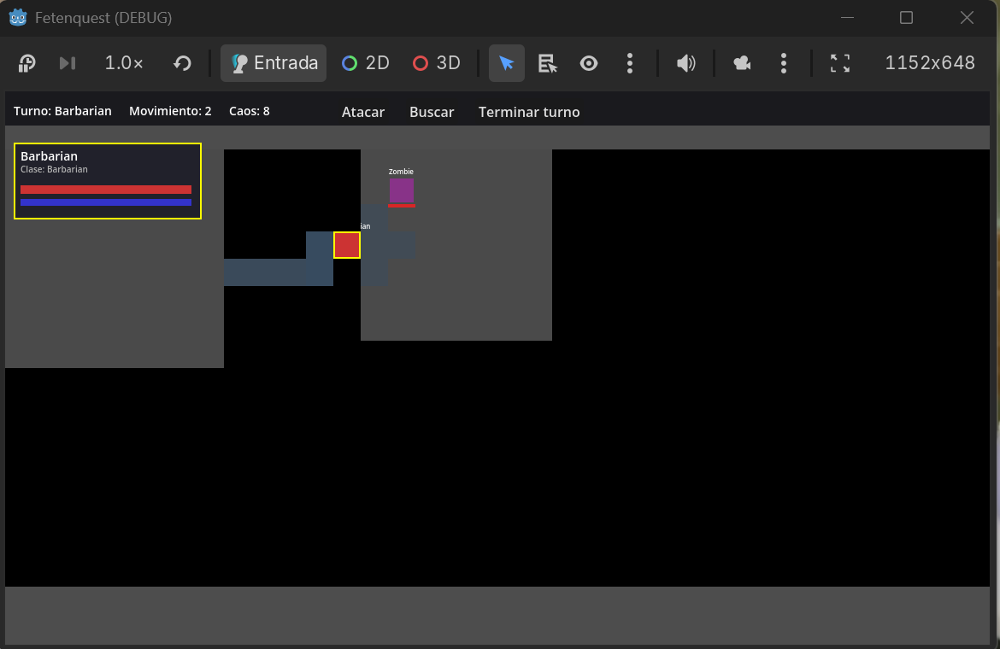
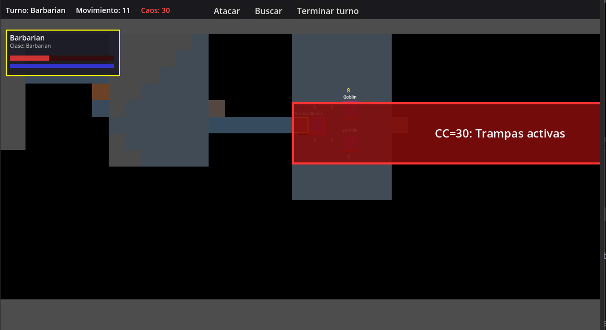
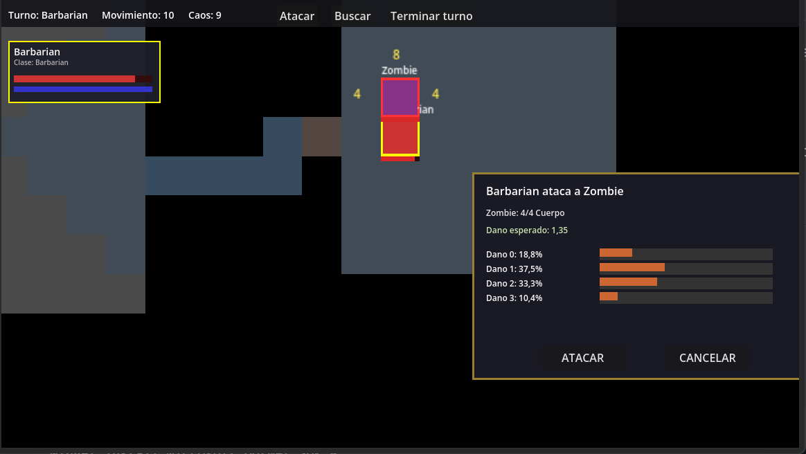
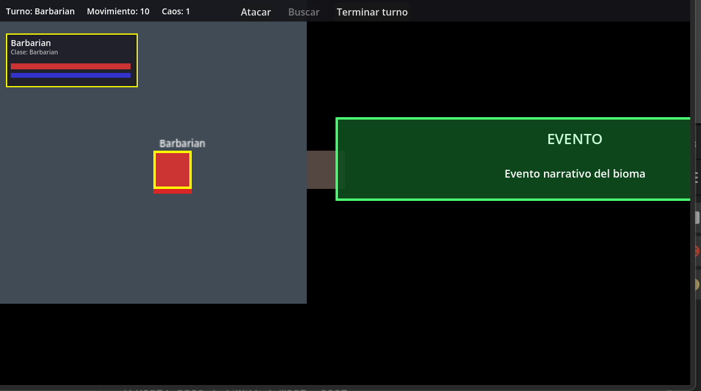

# Fetenquest

Dungeon crawler por turnos, grid-based, con permadeath por mercenario. Una reimaginación roguelike de HeroQuest con profundidad moderna — un mix del core de Fire Emblem con el loop de Darkest Dungeon.

## Concepto

Fetenquest toma la esencia del HeroQuest clásico de tablero y la lleva a un loop roguelike completo. La tensión viene de tres fuentes:

- **Contador de Caos** — cada turno que pasa el brujo refuerza la mazmorra. No puedes tomarte tu tiempo.
- **Permadeath de mercenarios** — perder un personaje es perder su equipo para siempre.
- **El escape** — matar al jefe no termina la run. Tienes que salir vivo de la mazmorra para conservar el botín.

## Gameplay

### Vista general

La mazmorra se revela mediante niebla de guerra. Los pasillos aparecen celda a celda al recorrerlos; las habitaciones se descubren de golpe al abrir su puerta. Arriba se muestra el turno activo, los puntos de movimiento restantes y el Contador de Caos.



*Turno del Barbarian con 2 puntos de movimiento restantes. Caos: 8. La habitación central está revelada; el resto de la mazmorra permanece en negro.*

---

### Contador de Caos

El Contador de Caos sube cada turno y nunca se detiene. Al llegar a ciertos umbrales activa efectos globales que hacen la mazmorra más peligrosa. El número se vuelve rojo cuando alcanza un umbral crítico.



*Caos: 30 — se activan las trampas en toda la mazmorra. Los umbrales son: 10 (monstruo errante), 20 (buff a monstruos), 30 (trampas activas), 40 (jefe activo), 50+ (spawn continuo).*

---

### Preview de ataque

Antes de confirmar un ataque el juego muestra la distribución de probabilidades exacta: cuánto daño puedes hacer y con qué porcentaje. Así puedes valorar el riesgo antes de comprometer el turno.



*Barbarian ataca a Zombie con 3 dados. Daño esperado: 1,35. La barra muestra la probabilidad de cada resultado posible (0–3 daño) calculada por combinatoria exacta.*

---

### Acción de Buscar — Carta de Tesoro

Al usar la acción **Buscar** en una sala el mercenario roba una carta del mazo del bioma. Las cartas pueden ser oro, equipo, eventos narrativos u otros efectos inmediatos.



*Resultado: evento narrativo del bioma. El mazo tiene 20 cartas barajadas al inicio de cada run; cada sala solo puede buscarse una vez.*

## Primeros pasos

### Requisitos

- [Godot 4.6.2 Mono](https://godotengine.org/download) — la version con soporte C#, **no** la estandar
- [.NET 8 SDK](https://dotnet.microsoft.com/download/dotnet/8.0)

Instalacion rapida con winget (Windows):
```
winget install GodotEngine.GodotEngine.Mono
winget install Microsoft.DotNet.SDK.8
```

### Clonar y compilar

```
git clone https://github.com/J0rgw/fetenquest.git
cd fetenquest
dotnet build
```

### Abrir el proyecto en Godot

1. Abre una terminal en la carpeta del proyecto
2. Lanza Godot desde la terminal (importante para que detecte el SDK de .NET):
```
Godot_v4.6.2-stable_mono_win64.exe
```
3. Se abre el **Project Manager**. Tienes dos opciones:
   - **Importar proyecto existente:** haz clic en "Importar", navega hasta la carpeta del proyecto y selecciona el archivo `project.godot`
   - **Si ya aparece en la lista:** simplemente haz doble clic sobre el

4. Una vez dentro del editor, pulsa **F5** para ejecutar

> **Nota:** lanza siempre Godot desde la terminal estando dentro de la carpeta del proyecto. Si lo abres desde el acceso directo del escritorio o el menu inicio puede que no detecte el SDK de .NET y el build falle.

---

## Stack

- **Motor:** Godot 4.6.2 Mono
- **Lenguaje:** C# (.NET 8)
- **Plataforma objetivo:** Steam/PC

## Clases

| Clase | Cuerpo | Mente | Ataque | Defensa | Rol |
|-------|--------|-------|--------|---------|-----|
| Orco Barbaro | 8 | 2 | 3 dados | 2 dados | DPS melee, primera linea |
| Humano Mago | 3 | 5 | 1 dado | 1 dado | Control, dano a distancia |
| Elfo Explorador | 5 | 4 | 2 dados | 2 dados | Explorador, ranged, trampas |
| Enano Tanque | 6 | 3 | 2 dados | 3 dados | Tanque puro, proteger pasillos |

## Loop principal

```
Ciudad Hub
  └── Reclutar mercenarios / equipar / comprar mochilas
        └── Mazmorra (generacion procedural)
              └── Explorar / combatir / buscar tesoros
                    └── Derrotar al jefe
                          └── Fase de escape
                                ├── Escape exitoso → conservas todo
                                └── Derrota → perdida escalonada de oro
```

## Sistemas implementados

### Fase 1 — Arquitectura base (completa)

| Sistema | Descripcion |
|---------|-------------|
| `GameState` | Singleton global. Oro permanente, oro de run, slots de mercenario, estado de run activa |
| `DiceSystem` | Dados de combate custom (calavera / escudo blanco / escudo negro), 2d6 de movimiento, probabilidades por combinatoria exacta |
| `Entity` | Clase base abstracta de mercenarios y monstruos. Stats, posicion en grid, recibir daño, curar |
| `MercenaryInstance` | Stats por clase, pool de movimiento dividido, permadeath con perdida de equipo |
| `MonsterInstance` | Comportamiento Territorial/Agresivo, conversion automatica a Agresivo por Mente <= 1 o trait |
| `TurnManager` | Cola de turnos mercenarios → monstruos, señales de inicio y fin de ronda |
| `ChaosSystem` | Contador de Caos con 5 umbrales: monstruo errante (10), buff monstruos (20), trampas (30), jefe activo (40), spawn continuo (50+) |
| `GridManager` | Grid 2D con TileType, pathfinding A*, linea de vision Bresenham, zona de control de monstruos |
| `FogOfWarSystem` | Revelacion celda a celda en pasillos, revelacion total de habitacion al abrir puerta, LOS para activacion de monstruos |
| `CombatSystem` | Resolucion de ataque/defensa con distincion heroe/monstruo en escudos, preview de probabilidades antes de confirmar |
| `EscapeSystem` | Deteccion de jefe derrotado, fase de escape, perdida escalonada de oro segun profundidad alcanzada |
| `TreasureSystem` | Mazo de 20 cartas por bioma barajado al inicio, robo de carta con efectos inmediatos, historial de busquedas por sala |
| `RoomTemplate` | Plantilla de sala con layout, spawn points, tipo, bioma y conexiones posibles |
| `DungeonRoom` | Sala instanciada en la run con conexiones, monstruos activos y estado de revelacion |
| `DungeonGenerator` | Generacion procedural estilo Binding of Isaac: pool de plantillas, cadena principal, camino valido garantizado, poblacion de monstruos por bioma |

## Estructura del proyecto

```
res://
├── src/
│   ├── core/        # GameState, DiceSystem, TurnManager, ChaosSystem,
│   │                # FogOfWarSystem, CombatSystem, EscapeSystem, TreasureSystem
│   ├── entities/    # Entity, MercenaryInstance, MonsterInstance
│   ├── grid/        # GridManager
│   ├── dungeon/     # RoomTemplate, DungeonRoom, DungeonGenerator
│   └── data/        # Resources: clases, items (pendiente)
├── scenes/          # Escenas .tscn
├── assets/          # Sprites placeholder
└── resources/       # Archivos .tres
```

## Biomas

| Bioma | Dificultad | Enemigos |
|-------|-----------|----------|
| Las Alcantarillas | Introductorio | Goblins, zombies, ratas gigantes |
| El Castillo Abandonado | Medio | Esqueletos, caballeros muertos |
| Las Cuevas del Brujo | Dificil | Cultistas, brujo (jefe final) |

## Estado actual

### Completado
- Fase 1 completa: todos los sistemas core implementados y testeados en escena de prueba de consola
- Generacion procedural de mazmorras funcionando con poblacion de monstruos por bioma
- Sistema de dados con probabilidades exactas por combinatoria
- Permadeath, perdida escalonada de oro y fase de escape funcionando

### Implementado (Fase 2)
- Escena visual con TileMap y sprites placeholder
- Input del jugador (click para mover, click para atacar)
- UI: barra de vida, contador de caos, panel de turno
- Integracion de todos los sistemas en la escena de juego real

### Pendiente (Fase 2)
- 66 plantillas de sala manuales (22 por bioma)
- Ciudad Hub con reclutamiento y tienda
